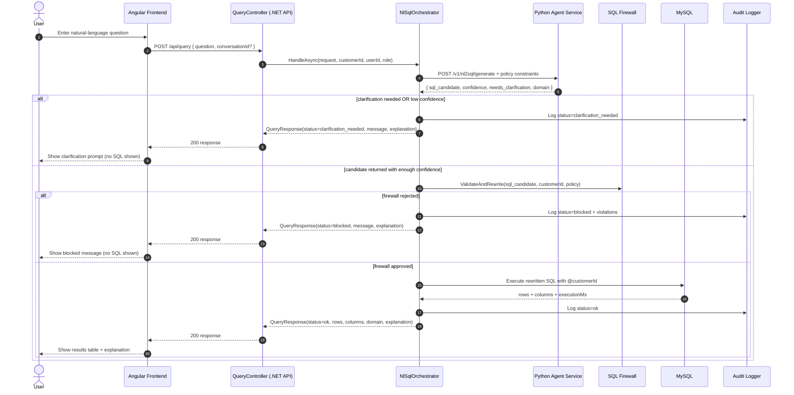
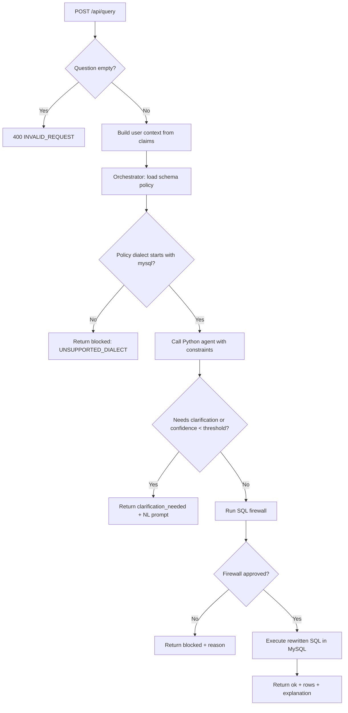
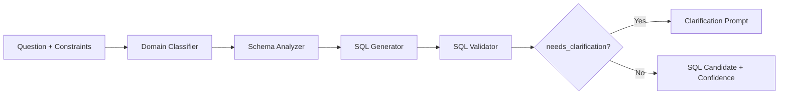

# 🔄 Message & Control Flow

This document shows how a natural-language request moves through the system and how control branches for success, clarification, and blocked/error outcomes.

## End-to-End Sequence

## API Control Flow

## Agent Internal Flow (High-Level)

## Notes For New Developers

- Trust boundary is the .NET API: only it can execute SQL.
- Python agent is untrusted and only suggests SQL.
- Frontend never receives SQL text; it receives only safe response metadata and rows.
- Tenant isolation is always injected by firewall via `CustomerId = @customerId`.
- Policy constraints (`allowedTables`, `allowedFunctions`, limits, dialect) are sent to agent and enforced again by firewall.
